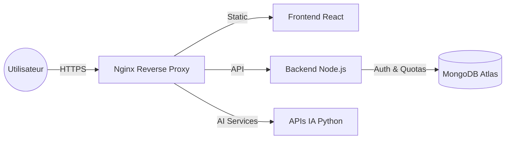

# Tool.IA - La boîte à outils IA de bout en bout

**Tool.IA** est une plateforme SaaS Fullstack regroupant plusieurs outils d'intelligence artificielle de niveau production. De la vision par ordinateur à la synthèse vocale, l'application offre un hub centralisé pour les créateurs, e-commerçants et designers.

🔗 **Démo en ligne :** https://tool-ia.duckdns.org


---

## ✨ Les Outils (La Suite Tool.IA)

- ✂️ **Détourage Magique (Actif)** : Suppression automatique du fond d'une image via le modèle de Deep Learning U²-Net (RemBG).
- 🎙️ **Text-to-Speech & Clonage Vocal (En construction)** : Génération d'audio haute qualité et clonage de voix.
- 🎨 **Studio d'Images (En construction)** : Génération et modification avancée d'images via Stable Diffusion et ControlNet (ProperShot, PhotoAI, InteriorAI).

---

## 🏗️ Architecture Technique

Ce projet repose sur une architecture **microservices** robuste, prête pour la mise en production et hébergée sur un VPS (AWS EC2).

| Partie | Technologies | Rôle |
|--------|-------------|------|
| **Frontend** | React.js, Vite, Tailwind CSS | Interface utilisateur (SPA), Hub & Landing Page |
| **Backend API** | Node.js, Express, MongoDB | Auth (JWT), gestion des utilisateurs, quotas, paiements |
| **Services IA** | Python, FastAPI, ML Models | Inférence des modèles (Vision, Audio, Génération) |
| **DevOps** | AWS EC2, Nginx, PM2, Certbot | Hébergement, reverse proxy, sécurisation HTTPS |

---

### 📦 Schéma de déploiement (VPS)



## 🛠️ Installation Locale

Si vous souhaitez exécuter le projet en local :

### 1️⃣ Prérequis

- Node.js (v18+)
- Python (v3.10+)
- MongoDB (Atlas ou local)

---

### 2️⃣ Cloner le projet

```bash
git clone https://github.com/yannis-fontaine/saas-detourage.git
cd TON_PROJET
```

---

### 3️⃣ Configuration du Backend (Node.js)

```bash
cd backend-api
npm install
```

Créer un fichier `.env` :

```env
MONGO_URI=votre_lien_mongodb
JWT_SECRET=votre_secret
FRONTEND_URL=http://localhost:5173
PORT=5000
```

Lancer le serveur :

```bash
npm start
```

---

### 4️⃣ Configuration du Service IA (Python)

```bash
cd ../ai-service
python -m venv venv
```

Activation de l’environnement virtuel :

Mac / Linux :
```bash
source venv/bin/activate
```

Windows :
```bash
venv\Scripts\activate
```

Installation des dépendances :

```bash
pip install -r requirements.txt
```

Lancer le serveur FastAPI :

```bash
uvicorn main:app --reload --port 8000
```

---

### 5️⃣ Lancer le Frontend (React)

```bash
cd ../frontend
npm install
npm run dev
```

---

## 🔒 Sécurité

- Authentification sécurisée via JWT.
- Mots de passe hashés en base de données.
- Protection de l'infrastructure via reverse proxy Nginx.
- Trafic chiffré HTTPS (Certificat Let's Encrypt).

---

## 👨‍💻 Auteur

**Yannis Fontaine**
