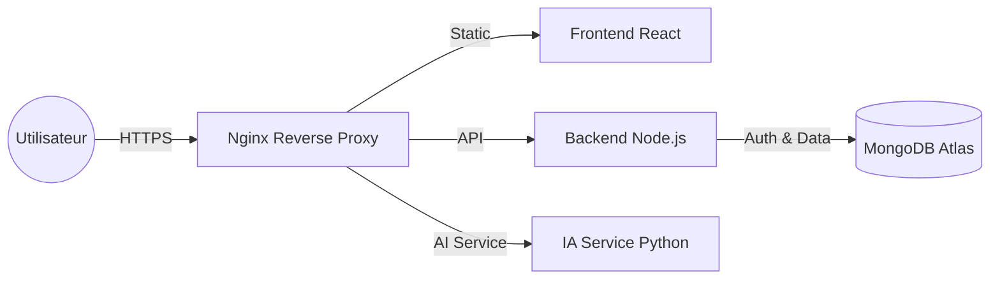

# 🪄 DetourImage - SaaS de Détourage par IA


**DetourImage** est une application SaaS Fullstack permettant de retirer automatiquement le fond d'une image en quelques secondes grâce à l’intelligence artificielle.

🔗 **Démo en ligne :**  
https://detourimage.duckdns.org

---

## 🏗️ Architecture Technique

Ce projet repose sur une architecture **microservices** hébergée sur un VPS (AWS EC2).

| Partie | Technologies | Rôle |
|--------|-------------|------|
| **Frontend** | React.js, Vite, Axios | Interface utilisateur (SPA) |
| **Backend API** | Node.js, Express, MongoDB | Authentification (JWT) & gestion des utilisateurs |
| **Service IA** | Python, FastAPI, RemBG (U2Net) | Traitement d'image & détourage |
| **DevOps** | AWS EC2, Nginx, PM2, Certbot | Hébergement, reverse proxy, HTTPS |

---

### 📦 Schéma de déploiement (VPS)



---

## ✨ Fonctionnalités

- ✅ **Authentification** : inscription et connexion sécurisées (JWT)
- ✅ **Upload d’image** : support PNG, JPG, JPEG
- ✅ **Détourage IA** : suppression du fond via le modèle U2Net (RemBG)
- ✅ **Téléchargement** : récupération de l’image détourée en haute qualité
- ✅ **Sécurité** : HTTPS (Let's Encrypt), hashage des mots de passe

---

## 🛠️ Installation Locale

Si vous souhaitez exécuter le projet en local :

### 1️⃣ Prérequis

- Node.js (v18+)
- Python (v3.10+)
- MongoDB (Atlas ou local)

---

### 2️⃣ Cloner le projet

```bash
git clone https://github.com/TON_PSEUDO/TON_PROJET.git
cd TON_PROJET
```

---

### 3️⃣ Configuration du Backend (Node.js)

```bash
cd backend-api
npm install
```

Créer un fichier `.env` :

```env
MONGO_URI=votre_lien_mongodb
JWT_SECRET=votre_secret
PORT=5000
```

Lancer le serveur :

```bash
npm start
```

---

### 4️⃣ Configuration du Service IA (Python)

```bash
cd ../ai-service
python -m venv venv
```

Activation de l’environnement virtuel :

Mac / Linux :
```bash
source venv/bin/activate
```

Windows :
```bash
venv\Scripts\activate
```

Installation des dépendances :

```bash
pip install -r requirements.txt
```

Lancer le serveur FastAPI :

```bash
uvicorn main:app --reload --port 8000
```

---

### 5️⃣ Lancer le Frontend (React)

```bash
cd ../frontend
npm install
npm run dev
```

---

## 🔒 Sécurité

- Authentification via JWT
- Mots de passe hashés
- Reverse proxy Nginx
- Certificat SSL via Let's Encrypt

---

## 👨‍💻 Auteur

**Yannis Fontaine**
